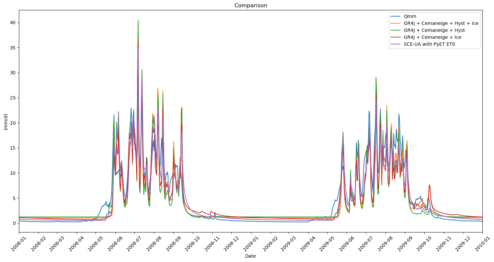

Tutorial File for RRMPG - Alpine
================================

In this notebook, we will explore new implementations of the
**RRMPG-Alpine** package, focusing on hydrological modeling for the
**Fagge (Gepatschalm) catchment**.

The provided dataset, **fag_gep_modified.csv**, includes daily
measurements from the catchment area. These data points cover a range of
hydrological and climatic variables:

+-------------------------+----------------------------------------------------------------------------------------------------------------------+
| **Variable**            | **Source**                                                                                                           |
+=========================+======================================================================================================================+
| **Precipitation [mm]**  | [1]                                                                                                                  |
+-------------------------+----------------------------------------------------------------------------------------------------------------------+
| **Tmax [°C]**           | [2]                                                                                                                  |
+-------------------------+----------------------------------------------------------------------------------------------------------------------+
| **Tmin [°C]**           | [2]                                                                                                                  |
+-------------------------+----------------------------------------------------------------------------------------------------------------------+
| **Tmean [°C]**          | [2]                                                                                                                  |
+-------------------------+----------------------------------------------------------------------------------------------------------------------+
| **ET0 [mm]**            | [3]                                                                                                                  |
+-------------------------+----------------------------------------------------------------------------------------------------------------------+
| **Qmm [mm]**            | [4]                                                                                                                  |
+-------------------------+----------------------------------------------------------------------------------------------------------------------+
| **Snow Cover Data**     | [5]                                                                                                                  |
+-------------------------+----------------------------------------------------------------------------------------------------------------------+

[1] Hiebl, J.; Frei, C. (2018): *Daily precipitation grids for Austria since 1961—development and evaluation of a spatial dataset for hydroclimatic monitoring and modelling*. Theor Appl Climatol 132 (1–2), 327–345. DOI: 10.1007/s00704-017-2093-x  

[2] Hiebl, J.; Frei, C. (2016): *Daily temperature grids for Austria since 1961—concept, creation and applicability*. Theor Appl Climatol 124 (1–2), 161–178. DOI: 10.1007/s00704-015-1411-4  

[3] Haslinger, K.; Bartsch, A. (2016): *Creating long-term gridded fields of reference evapotranspiration in Alpine terrain based on a recalibrated Hargreaves method*. Hydrology and Earth System Sciences 20(3), 1211–1223. DOI: 10.5194/hess-20-1211-2016  

[4] eHYD – Austrian Hydrological Data Service. Website: ehyd.gv.at  

[5] MODIS Snow Cover Data for 5 elevation bands. Website: nsidc.org/data/modis  

--------------

**Modeling Tasks to Be Performed:**
-----------------------------------

The following tasks will be performed using the provided data:

1. **Cemaneige + Hysteresis + Icemelt + GR4J**
2. **Cemaneige + Hysteresis + GR4J**
3. **Cemaneige + Icemelt + GR4J**
4. **Calculate ET0 using PyET**
5. **Calibration using SCE-UA Algorithm**
6. **Visualization and Analysis**

**Input**
---------

.. code:: ipython3

    # Notebook setup
    import numpy as np
    import pandas as pd
    import matplotlib.pyplot as plt
    import matplotlib.dates as mdates
    import spotpy
    
    from rrmpg.models import CemaneigeHystGR4J, CemaneigeGR4JIce, CemaneigeHystGR4JIce
    from spotpy.objectivefunctions import kge
    from spotpy.parameter import Uniform
    from scipy.stats import gamma
    import pyet

.. code:: ipython3

    # fag_gep
    df_in = pd.read_csv("fag_gep_modified.csv", index_col="Date", sep=";", decimal=".", parse_dates=["Date"])
    df_in.index

.. parsed-literal::

    DatetimeIndex(['2000-02-26', '2000-02-27', '2000-02-28', '2000-02-29',
                   '2000-03-01', '2000-03-02', '2000-03-03', '2000-03-04',
                   '2000-03-05', '2000-03-06',
                   ...
                   '2021-12-22', '2021-12-23', '2021-12-24', '2021-12-25',
                   '2021-12-26', '2021-12-27', '2021-12-28', '2021-12-29',
                   '2021-12-30', '2021-12-31'],
                  dtype='datetime64[ns]', name='Date', length=7959, freq=None)

.. code:: ipython3

    # define the elevations
    elevation = [float(2277.84423828125), # Mean elevation band 1
                float(2641.563720703125), # Mean elevation band 2
                float(2845.09521484375), # Mean elevation band 3
                float(3002.329833984375), # Mean elevation band 4
                float(3227.36669921875)] # Mean elevation band 5
    
    mean_elev = 2798.84033203125 # Mean elevation of the catchment

.. code:: ipython3

    # Glacier fraction for each elevation layer
    frac_ice = np.array([0.022034026, 0.042062109, 0.246620231, 0.507329678, 0.709368134])

.. code:: ipython3

    # Generating a dataframe to store the simulated discharges
    # Initialize columns with no data
    df1 = pd.DataFrame({
        'Datum': df_in.index,  # Using the index of df_in for the 'Datum' column
        'Qmm': df_in['Qmm'],  # Column 'Qmm' from df_in
        'sim HystIce(mm/d)': np.nan, # Cemaneige + Hysteresis + Icemelt + GR4J
        'sim Hyst(mm/d)': np.nan, # Cemaneige + Hysteresis + GR4J
        'sim CemaneigeIce(mm/d)': np.nan, # Cemaneige + Icemelt + GR4J
        'Q_sceua(mm/d)': np.nan}) # SCE-UA with PyET ET0
    
    # Display the first few rows of df1
    print(df1.head())

.. parsed-literal::

                    Datum       Qmm  sim HystIce(mm/d)  sim Hyst(mm/d)  \
    Date                                                                 
    2000-02-26 2000-02-26  0.263825                NaN             NaN   
    2000-02-27 2000-02-27  0.260942                NaN             NaN   
    2000-02-28 2000-02-28  0.258058                NaN             NaN   
    2000-02-29 2000-02-29  0.258058                NaN             NaN   
    2000-03-01 2000-03-01  0.258058                NaN             NaN   
    
                sim CemaneigeIce(mm/d)  Q_sceua (mm/d)  
    Date                                                
    2000-02-26                     NaN             NaN  
    2000-02-27                     NaN             NaN  
    2000-02-28                     NaN             NaN  
    2000-02-29                     NaN             NaN  
    2000-03-01                     NaN             NaN  
    

**Cemaneige + Hysteresis + Icemelt + GR4J**
-------------------------------------------

This section describes the setup and calibration process for the coupled
hydrological model, which integrates the following components:

- **Cemaneige Snow Model** + **Hysteresis** + **Icemelt Model** + **GR4J
  Rainfall-Runoff Model**

**Calibration Methodology**
~~~~~~~~~~~~~~~~~~~~~~~~~~~

The calibration of the coupled model is performed using an **objective
function** :

- **75% Discharge Data** (Qmm): Used to calibrate the model’s
  hydrological performance.
- **25% Remote Sensing Snow Cover Data**: This is split across the 5
  elevation bands, with 5% allocated per elevation band for snow cover
  calibration.

**Loss Metric Options**
~~~~~~~~~~~~~~~~~~~~~~~

During the calibration process, users can select between two different
loss metrics to evaluate model performance:

1. **Kling-Gupta Efficiency (KGE)**

2. **Mean Squared Error (MSE)**

.. code:: ipython3

    # Define the model with initial parameters
    model1 = CemaneigeHystGR4JIce()
    params1= {'CTG': 0.43, 'Kf': 3.5, # Cemaneige parameters
              'Thacc': 43, 'Rsp': 0.23, # Hysteresis parameters
              'x1': 210, 'x2': 3.4, # GR4J parameters
              'x3': 49, 'x4': 2.2, # GR4J parameters
              "DDF": 5} # Icemelt parameters
    model1.set_params(params1) # Set the parameters

.. code:: ipython3

    # NDSI from df_in into SCA (snow covered area) for each band
    sca1modis = (0.06 + 1.21 * df_in["NDSI1"]).clip(upper=100)
    sca2modis = (0.06 + 1.21 * df_in["NDSI2"]).clip(upper=100)
    sca3modis = (0.06 + 1.21 * df_in["NDSI3"]).clip(upper=100)
    sca4modis = (0.06 + 1.21 * df_in["NDSI4"]).clip(upper=100)
    sca5modis = (0.06 + 1.21 * df_in["NDSI5"]).clip(upper=100)

.. code:: ipython3

    # Fit the model
    # Choose the loss metric: kge or mse
    result = model1.fit_Q_SCA(df_in["Qmm"], df_in['P'], df_in['Tmean'], df_in['Tmin'], 
                        df_in['Tmax'], df_in['ET0'], frac_ice, sca1modis, sca2modis, sca3modis, sca4modis, sca5modis,
                        met_station_height=mean_elev, loss_metric="kge", # mse or kge 
                        altitudes=elevation, s_init=0.5, r_init=0.4, sca_init=0.2)
    print(result)

.. parsed-literal::

                 message: Optimization terminated successfully.
                 success: True
                     fun: 0.18688101205827204
                       x: [ 9.030e-01  2.223e+00  8.287e+01  1.000e+00
                            3.730e+01  3.000e+00  2.328e+01  1.282e+00
                            6.287e+00]
                     nit: 59
                    nfev: 8910
              population: [[ 9.030e-01  2.242e+00 ...  1.293e+00  5.274e+00]
                           [ 9.078e-01  2.186e+00 ...  1.287e+00  7.778e+00]
                           ...
                           [ 8.727e-01  2.164e+00 ...  1.276e+00  6.500e+00]
                           [ 8.581e-01  2.158e+00 ...  1.235e+00  8.011e+00]]
     population_energies: [ 1.869e-01  1.906e-01 ...  1.895e-01  1.904e-01]
                     jac: [ 0.000e+00 -5.401e-05  1.677e-05 -9.214e-03
                            4.304e-05 -7.466e-03  6.274e-05 -3.086e-05
                           -3.378e-05]
    

.. code:: ipython3

    # Set the model parameters to the ones found by the calibration
    params = {}
    
    param_names = model1.get_parameter_names()
    
    for i, param in enumerate(param_names):
        params[param] = result.x[i]
    
    # This line set the model parameters to the ones specified in the dict
    model1.set_params(params)
    
    # To be sure, let's look at the current model parameters
    model1.get_params()

.. parsed-literal::

    {'CTG': np.float64(0.9030015353603938),
     'Kf': np.float64(2.223066466942482),
     'Thacc': np.float64(82.87006309545102),
     'Rsp': np.float64(1.0),
     'x1': np.float64(37.298698767874896),
     'x2': np.float64(3.0),
     'x3': np.float64(23.276144152901534),
     'x4': np.float64(1.282197809132866),
     'DDF': np.float64(6.286671950232253)}

.. code:: ipython3

    # Simulate the discharge and sca, icemlet, snowmelt, rain
    # Store the simulated discharge in the df1 dataframe
    df1['sim HystIce(mm/d)'],_,_,_,_,sca, icemelt, snowmelt, rain = model1.simulate(df_in['P'], df_in['Tmean'], df_in['Tmin'], 
                                df_in['Tmax'], df_in['ET0'], frac_ice, met_station_height=mean_elev, 
                                altitudes=elevation, s_init=0.5, r_init=0.4, sca_init=0.2, return_storages=True) # Return the storages sca, icemelt, snowmelt, rain

**Cemaneige + Hysteresis + GR4J**
---------------------------------

This section describes the setup and calibration process for the coupled
hydrological model, which integrates the following components:

- **Cemaneige Snow Model** with **Hysteresis** + **GR4J Rainfall-Runoff
  Model**

**Calibration Methodology**
~~~~~~~~~~~~~~~~~~~~~~~~~~~

The calibration of the coupled model is performed using an **objective
function** :

- **75% Discharge Data** (Qmm): Used to calibrate the model’s
  hydrological performance.
- **25% Remote Sensing Snow Cover Data**: This is split across the 5
  elevation bands, with 5% allocated per elevation band for snow cover
  calibration.

**Loss Metric Options**
~~~~~~~~~~~~~~~~~~~~~~~

During the calibration process, users can select between two different
loss metrics to evaluate model performance:

1. **Kling-Gupta Efficiency (KGE)**

2. **Mean Squared Error (MSE)**

.. code:: ipython3

    # Define the model with initial parameters
    model2 = CemaneigeHystGR4J()
    params2= {'CTG': 0.43, 'Kf': 3.5, # Cemaneige parameters
              'Thacc': 43, 'Rsp': 0.23,  # Hysteresis parameters
              'x1': 210, 'x2': 3.4,
              'x3': 49, 'x4': 2.2}  # GR4J parameters
    model2.set_params(params2)

.. code:: ipython3

    # NDSI from df_in into SCA
    sca1modis = (0.06 + 1.21 * df_in["NDSI1"]).clip(upper=100)
    sca2modis = (0.06 + 1.21 * df_in["NDSI2"]).clip(upper=100)
    sca3modis = (0.06 + 1.21 * df_in["NDSI3"]).clip(upper=100)
    sca4modis = (0.06 + 1.21 * df_in["NDSI4"]).clip(upper=100)
    sca5modis = (0.06 + 1.21 * df_in["NDSI5"]).clip(upper=100)

.. code:: ipython3

    result = model2.fit_Q_SCA(df_in["Qmm"], df_in['P'], df_in['Tmean'], df_in['Tmin'], 
                        df_in['Tmax'], df_in['ET0'], sca1modis, sca2modis, sca3modis, sca4modis, sca5modis, met_station_height=mean_elev, loss_metric="kge", # mse or kge 
                        altitudes=elevation, s_init=0.5, r_init=0.4, sca_init=0.2)
    
    print(result)

.. parsed-literal::

                 message: Optimization terminated successfully.
                 success: True
                     fun: 0.19273413442184115
                       x: [ 9.370e-01  2.352e+00  8.318e+01  1.000e+00
                            1.000e+01  3.000e+00  2.118e+01  1.286e+00]
                     nit: 68
                    nfev: 8505
              population: [[ 9.370e-01  2.385e+00 ...  2.070e+01  1.282e+00]
                           [ 9.215e-01  2.322e+00 ...  2.091e+01  1.275e+00]
                           ...
                           [ 9.423e-01  2.392e+00 ...  2.051e+01  1.293e+00]
                           [ 9.381e-01  2.354e+00 ...  2.050e+01  1.293e+00]]
     population_energies: [ 1.927e-01  1.943e-01 ...  1.941e-01  1.939e-01]
                     jac: [ 0.000e+00 -8.071e-06 -5.884e-07 -1.925e-02
                            6.980e-05 -1.477e-02  1.890e-06 -2.032e-06]
    

.. code:: ipython3

    # Set the model parameters to the ones found by the calibration
    params = {}
    
    param_names = model2.get_parameter_names()
    
    for i, param in enumerate(param_names):
        params[param] = result.x[i]
    
    # This line set the model parameters to the ones specified in the dict
    model2.set_params(params)
    
    # To be sure, let's look at the current model parameters
    model2.get_params()

.. parsed-literal::

    {'CTG': np.float64(0.9370422854981424),
     'Kf': np.float64(2.352286935680163),
     'Thacc': np.float64(83.18303250166798),
     'Rsp': np.float64(1.0),
     'x1': np.float64(10.0),
     'x2': np.float64(3.0),
     'x3': np.float64(21.18412983923393),
     'x4': np.float64(1.2863423622675372)}

.. code:: ipython3

    # Simulate the discharge and store it in the df1 dataframe
    df1['sim Hyst(mm/d)']= model2.simulate(df_in['P'], df_in['Tmean'], df_in['Tmin'], 
                                df_in['Tmax'], df_in['ET0'], met_station_height=mean_elev, 
                                altitudes=elevation, s_init=0.5, r_init=0.4, sca_init=0.2)

**Cemaneig + Icemelt + GR4J**
-----------------------------

This section describes the setup and calibration process for the coupled
hydrological model, which integrates the following components:

- **Cemaneige Snow Model** (**WITHOUT** Hysteresis) + **Icemelt Model**
  + **GR4J Rainfall-Runoff Model**

**Calibration Methodology**
~~~~~~~~~~~~~~~~~~~~~~~~~~~

The calibration of the coupled model is performed using a
**loss-function** only on discharge data. The available loss metric is
**Mean Squared Error (MSE)**.

.. code:: ipython3

    # Define the model with initial parameters
    model3 = CemaneigeGR4JIce()
    params3= {'CTG': 0.43, 'Kf': 3.5, # Cemaneige parameters
              'x1': 210, 'x2': 3.4,
              'x3': 49, 'x4': 2.2, # GR4J parameters
              "DDF": 5}   # Icemelt parameters
    model3.set_params(params3)

.. code:: ipython3

    # Fit the model
    result = model3.fit(df_in["Qmm"], df_in['P'], df_in['Tmean'], df_in['Tmin'], 
                        df_in['Tmax'], df_in['ET0'], frac_ice, met_station_height=mean_elev,
                        altitudes=elevation, s_init=0.5, r_init=0.4)
    print(result)

.. parsed-literal::

                 message: Optimization terminated successfully.
                 success: True
                     fun: 6.9031288676820255
                       x: [ 7.382e-01  4.075e+00  2.124e+02  2.971e+00
                            2.796e+01  1.261e+00  3.915e+00]
                     nit: 32
                    nfev: 4353
              population: [[ 7.382e-01  4.075e+00 ...  1.261e+00  3.915e+00]
                           [ 6.984e-01  4.039e+00 ...  1.364e+00  5.059e+00]
                           ...
                           [ 7.088e-01  4.135e+00 ...  1.317e+00  4.001e+00]
                           [ 7.612e-01  4.153e+00 ...  1.319e+00  3.653e+00]]
     population_energies: [ 6.903e+00  7.146e+00 ...  6.937e+00  6.947e+00]
    

.. code:: ipython3

    # Set the model parameters to the ones found by the calibration
    params = {}
    
    param_names = model3.get_parameter_names()
    
    for i, param in enumerate(param_names):
        params[param] = result.x[i]
    
    # This line set the model parameters to the ones specified in the dict
    model3.set_params(params)
    
    # To be sure, let's look at the current model parameters
    model3.get_params()

.. parsed-literal::

    {'CTG': np.float64(0.7382413930079459),
     'Kf': np.float64(4.075326104566461),
     'x1': np.float64(212.43962540529526),
     'x2': np.float64(2.9706486961437353),
     'x3': np.float64(27.958582971315394),
     'x4': np.float64(1.2609133662872083),
     'DDF': np.float64(3.9153425908335393)}

.. code:: ipython3

    df1['sim CemaneigeIce(mm/d)']= model3.simulate(df_in['P'], df_in['Tmean'], df_in['Tmin'], 
                                df_in['Tmax'], df_in['ET0'], frac_ice, met_station_height=mean_elev, 
                                altitudes=elevation, s_init=0.5, r_init=0.4)

**ET0 Calculation with PyET**
-----------------------------

In alpine regions **ET0** data is sometimes unavailable, the **PyET**
package can be used to calculate **ET0**. PyET is a Python library that
provides methods to estimate reference evapotranspiration using various
approaches, including the **Hargreaves** method, which is commonly used
in regions with limited meteorological data.

.. code:: ipython3

    # Load the dataframe without the ET0 column
    df_in = pd.read_csv("fag_gep_modified.csv", index_col="Date",  sep=";", decimal=".").drop(columns="ET0")
    
    # Use Hargreaves or Oudin method from PyET to calculate ET0
    lat = 46.9685*np.pi/180 # latitude of site
    df_in["ET0"] = pyet.hargreaves(df_in["Tmean"], df_in["Tmax"], df_in["Tmin"], lat=lat) # Hargreaves
    #df_in["ET0"] = pyet.oudin(df_in["Tmean"], lat=lat) # Oudin

**Model Calibration with Spotpy**
---------------------------------

This section outlines the integration of the **SCE-UA algorithm**
(Shuffled Complex Evolution – University of Arizona) from the **Spotpy**
package for model calibration. The **SCE-UA algorithm** is employed to
optimize the model parameters by minimizing the already introduced
objective function. The calibration process is carried out for the
following model combination: - **Cemaneige Snow Model** with
**Hysteresis** + **GR4J Rainfall-Runoff Model**

The **objective function** evaluates the model’s performance using the
**KGE** during the calibration process.

.. code:: ipython3

    # Define the model with initial parameters
    model4 = CemaneigeHystGR4J()
    params4= {'CTG': 0.43, 'Kf': 3.5, # Cemaneige parameters
              'Thacc': 43, 'Rsp': 0.23,  # Hysteresis parameters
              'x1': 210, 'x2': 3.4,
              'x3': 49, 'x4': 2.2}   # GR4J parameters
    model4.set_params(params4)

.. code:: ipython3

    # Setup of the spotpy class
    class spot_setup_gr4jhyst(object):  
        ctg = Uniform("CTG", low=0.1, high=1, optguess=0.8)
        kf = Uniform("Kf", low=0.1, high=10, optguess=4)  
        thacc = Uniform("thacc",  low=1, high=1000, optguess=400)
        rsp = Uniform("Rsp",  low=0.1, high=1, optguess=0.8) 
        x1 = Uniform("x1", low=1, high=1500, optguess=350)
        x2 = Uniform("x2", low=-5, high=10, optguess=0)  
        x3 = Uniform("x3",  low=1, high=500, optguess=40)
        x4 = Uniform("x4",  low=0.5, high=10, optguess=1.7)
        
        
        def __init__(self, obs, model, elevs, elevs_median, df_in):
            # Just a way to keep this example flexible and applicable to various examples
            self.trueObs = obs
            self.model = model   
            self.elevs = elevs
            self.elevs_median = elevs_median
            self.df_in = df_in
        
        def simulation(self, x):
            # Here the model is actualy started with a unique parameter combination that it gets from spotpy for each time the model is called
            params = {'CTG': x[0], "Kf": x[1],
                      'Thacc': x[2], 'Rsp': x[3],
                       'x1': x[4], "x2": x[5],
                       'x3': x[6], 'x4': x[7]}
            self.model.set_params(params)
            
            outflow, _, _, _, _, sca, _ = self.model.simulate(self.df_in['P'], self.df_in['Tmean'], self.df_in['Tmin'], 
                                   (self.df_in['Tmax']), self.df_in['ET0'], met_station_height=self.elevs_median,
                                   altitudes=self.elevs, s_init=0.5, r_init=0.4, sca_init=0.2, return_storages=True)
            sca1, sca2, sca3, sca4, sca5 = (
            sca[:, 0].flatten() * 100,  # Convert from fraction to percentage
            sca[:, 1].flatten() * 100,  
            sca[:, 2].flatten() * 100,
            sca[:, 3].flatten() * 100,
            sca[:, 4].flatten() * 100,
        )
            return [outflow.flatten(), sca1, sca2, sca3, sca4, sca5]
        
        def evaluation(self):
            return self.trueObs
    
        def objectivefunction(self, simulation, evaluation, params=None):
            loss_q = 1 - kge1(evaluation[0], simulation[0])
            loss_sca1 = 1 - kge1(evaluation[1], simulation[1])
            loss_sca2 = 1 - kge1(evaluation[2], simulation[2])
            loss_sca3 = 1 - kge1(evaluation[3], simulation[3])
            loss_sca4 = 1 - kge1(evaluation[4], simulation[4])
            loss_sca5 = 1 - kge1(evaluation[5], simulation[5])
            loss_value = (
            0.75 * loss_q +
            0.05 * loss_sca1 +
            0.05 * loss_sca2 +
            0.05 * loss_sca3 +
            0.05 * loss_sca4 +
            0.05 * loss_sca5
        )
            return loss_value
            
    
    def kge1(evaluation, simulation):
        df = pd.DataFrame({"obs": evaluation, "sim": simulation}).dropna()
        return kge(df["obs"].values, df["sim"].values)

.. code:: ipython3

    # Define the observed data and the sampler
    obs_in = [df_in["Qmm"], sca1modis.reindex(df_in.index), sca2modis.reindex(df_in.index), 
              sca3modis.reindex(df_in.index), sca4modis.reindex(df_in.index), sca5modis.reindex(df_in.index)]
    
    sampler=spotpy.algorithms.sceua(spot_setup_gr4jhyst(obs_in, model4, elevation, mean_elev, df_in), 
                                    save_sim = False, dbname='SCEUA_RRMPG', dbformat='csv')

.. code:: ipython3

    # Run the sampler
    sampler.sample(50000, ngs=10, kstop=50)

.. parsed-literal::

    Initializing the  Shuffled Complex Evolution (SCE-UA) algorithm  with  50000  repetitions
    The objective function will be minimized
    Starting burn-in sampling...
    Initialize database...
    ['csv', 'hdf5', 'ram', 'sql', 'custom', 'noData']
    * Database file 'SCEUA_RRMPG.csv' created.
    Burn-in sampling completed...
    Starting Complex Evolution...
    ComplexEvo loop #1 in progress...
    316 of 50000, minimal objective function=0.31852, time remaining: 00:05:19
    ComplexEvo loop #2 in progress...
    669 of 50000, minimal objective function=0.31852, time remaining: 00:04:58
    1016 of 50000, minimal objective function=0.31852, time remaining: 00:04:53
    ComplexEvo loop #3 in progress...
    1383 of 50000, minimal objective function=0.270656, time remaining: 00:04:49
    ComplexEvo loop #4 in progress...
    1745 of 50000, minimal objective function=0.270656, time remaining: 00:04:45
    ComplexEvo loop #5 in progress...
    2103 of 50000, minimal objective function=0.199888, time remaining: 00:04:41
    ComplexEvo loop #6 in progress...
    2467 of 50000, minimal objective function=0.199888, time remaining: 00:04:38
    2821 of 50000, minimal objective function=0.199888, time remaining: 00:04:35
    ComplexEvo loop #7 in progress...
    3179 of 50000, minimal objective function=0.182776, time remaining: 00:04:32
    ComplexEvo loop #8 in progress...
    3546 of 50000, minimal objective function=0.178186, time remaining: 00:04:29
    ComplexEvo loop #9 in progress...
    3910 of 50000, minimal objective function=0.178186, time remaining: 00:04:27
    ComplexEvo loop #10 in progress...
    4246 of 50000, minimal objective function=0.177967, time remaining: 00:04:26
    4596 of 50000, minimal objective function=0.176311, time remaining: 00:04:24
    ComplexEvo loop #11 in progress...
    4952 of 50000, minimal objective function=0.17232, time remaining: 00:04:22
    ComplexEvo loop #12 in progress...
    5302 of 50000, minimal objective function=0.17232, time remaining: 00:04:20
    ComplexEvo loop #13 in progress...
    5658 of 50000, minimal objective function=0.170067, time remaining: 00:04:18
    ComplexEvo loop #14 in progress...
    6011 of 50000, minimal objective function=0.169994, time remaining: 00:04:15
    6372 of 50000, minimal objective function=0.169102, time remaining: 00:04:13
    ComplexEvo loop #15 in progress...
    6721 of 50000, minimal objective function=0.167961, time remaining: 00:04:11
    ComplexEvo loop #16 in progress...
    7097 of 50000, minimal objective function=0.166626, time remaining: 00:04:09
    ComplexEvo loop #17 in progress...
    7448 of 50000, minimal objective function=0.16597, time remaining: 00:04:06
    ComplexEvo loop #18 in progress...
    7808 of 50000, minimal objective function=0.16597, time remaining: 00:04:04
    8168 of 50000, minimal objective function=0.165543, time remaining: 00:04:02
    ComplexEvo loop #19 in progress...
    8524 of 50000, minimal objective function=0.165503, time remaining: 00:04:00
    ComplexEvo loop #20 in progress...
    8867 of 50000, minimal objective function=0.165359, time remaining: 00:03:58
    ComplexEvo loop #21 in progress...
    9224 of 50000, minimal objective function=0.165359, time remaining: 00:03:56
    ComplexEvo loop #22 in progress...
    9592 of 50000, minimal objective function=0.165231, time remaining: 00:03:54
    9968 of 50000, minimal objective function=0.165231, time remaining: 00:03:52
    ComplexEvo loop #23 in progress...
    10344 of 50000, minimal objective function=0.165231, time remaining: 00:03:50
    ComplexEvo loop #24 in progress...
    10714 of 50000, minimal objective function=0.165136, time remaining: 00:03:48
    ComplexEvo loop #25 in progress...
    11051 of 50000, minimal objective function=0.165136, time remaining: 00:03:46
    11393 of 50000, minimal objective function=0.165136, time remaining: 00:03:45
    ComplexEvo loop #26 in progress...
    11731 of 50000, minimal objective function=0.165136, time remaining: 00:03:43
    ComplexEvo loop #27 in progress...
    12077 of 50000, minimal objective function=0.165136, time remaining: 00:03:41
    12423 of 50000, minimal objective function=0.165136, time remaining: 00:03:39
    ComplexEvo loop #28 in progress...
    12766 of 50000, minimal objective function=0.16511, time remaining: 00:03:37
    ComplexEvo loop #29 in progress...
    13115 of 50000, minimal objective function=0.16511, time remaining: 00:03:35
    ComplexEvo loop #30 in progress...
    13461 of 50000, minimal objective function=0.16511, time remaining: 00:03:33
    13794 of 50000, minimal objective function=0.16511, time remaining: 00:03:32
    ComplexEvo loop #31 in progress...
    14144 of 50000, minimal objective function=0.165083, time remaining: 00:03:30
    ComplexEvo loop #32 in progress...
    14497 of 50000, minimal objective function=0.165083, time remaining: 00:03:28
    14846 of 50000, minimal objective function=0.165083, time remaining: 00:03:26
    ComplexEvo loop #33 in progress...
    15197 of 50000, minimal objective function=0.165083, time remaining: 00:03:24
    ComplexEvo loop #34 in progress...
    15541 of 50000, minimal objective function=0.165083, time remaining: 00:03:22
    15888 of 50000, minimal objective function=0.165083, time remaining: 00:03:20
    ComplexEvo loop #35 in progress...
    16239 of 50000, minimal objective function=0.165083, time remaining: 00:03:18
    ComplexEvo loop #36 in progress...
    16588 of 50000, minimal objective function=0.165083, time remaining: 00:03:16
    ComplexEvo loop #37 in progress...
    16941 of 50000, minimal objective function=0.165083, time remaining: 00:03:14
    17297 of 50000, minimal objective function=0.165083, time remaining: 00:03:12
    ComplexEvo loop #38 in progress...
    17643 of 50000, minimal objective function=0.165083, time remaining: 00:03:10
    ComplexEvo loop #39 in progress...
    17988 of 50000, minimal objective function=0.165083, time remaining: 00:03:08
    18334 of 50000, minimal objective function=0.165083, time remaining: 00:03:07
    ComplexEvo loop #40 in progress...
    18683 of 50000, minimal objective function=0.165062, time remaining: 00:03:05
    ComplexEvo loop #41 in progress...
    19025 of 50000, minimal objective function=0.165062, time remaining: 00:03:02
    19371 of 50000, minimal objective function=0.165062, time remaining: 00:03:00
    ComplexEvo loop #42 in progress...
    19715 of 50000, minimal objective function=0.165053, time remaining: 00:02:58
    ComplexEvo loop #43 in progress...
    20085 of 50000, minimal objective function=0.165046, time remaining: 00:02:56
    ComplexEvo loop #44 in progress...
    20441 of 50000, minimal objective function=0.165046, time remaining: 00:02:54
    20818 of 50000, minimal objective function=0.165045, time remaining: 00:02:52
    ComplexEvo loop #45 in progress...
    21201 of 50000, minimal objective function=0.165037, time remaining: 00:02:49
    ComplexEvo loop #46 in progress...
    21575 of 50000, minimal objective function=0.165031, time remaining: 00:02:47
    ComplexEvo loop #47 in progress...
    21936 of 50000, minimal objective function=0.165026, time remaining: 00:02:45
    ComplexEvo loop #48 in progress...
    22303 of 50000, minimal objective function=0.165025, time remaining: 00:02:43
    22677 of 50000, minimal objective function=0.165023, time remaining: 00:02:40
    ComplexEvo loop #49 in progress...
    23054 of 50000, minimal objective function=0.165023, time remaining: 00:02:38
    ComplexEvo loop #50 in progress...
    23427 of 50000, minimal objective function=0.16502, time remaining: 00:02:36
    Objective function convergence criteria is now being updated and assessed...
    Updated convergence criteria: 86.028897
    ComplexEvo loop #51 in progress...
    23797 of 50000, minimal objective function=0.16502, time remaining: 00:02:34
    Objective function convergence criteria is now being updated and assessed...
    Updated convergence criteria: 87.535024
    ComplexEvo loop #52 in progress...
    24172 of 50000, minimal objective function=0.16502, time remaining: 00:02:31
    24543 of 50000, minimal objective function=0.16502, time remaining: 00:02:29
    Objective function convergence criteria is now being updated and assessed...
    Updated convergence criteria: 61.313704
    ComplexEvo loop #53 in progress...
    24915 of 50000, minimal objective function=0.16502, time remaining: 00:02:27
    Objective function convergence criteria is now being updated and assessed...
    Updated convergence criteria: 58.816484
    ComplexEvo loop #54 in progress...
    25280 of 50000, minimal objective function=0.16502, time remaining: 00:02:25
    Objective function convergence criteria is now being updated and assessed...
    Updated convergence criteria: 20.733937
    ComplexEvo loop #55 in progress...
    25657 of 50000, minimal objective function=0.165019, time remaining: 00:02:23
    Objective function convergence criteria is now being updated and assessed...
    Updated convergence criteria: 20.820275
    ComplexEvo loop #56 in progress...
    26029 of 50000, minimal objective function=0.165019, time remaining: 00:02:20
    26401 of 50000, minimal objective function=0.165019, time remaining: 00:02:18
    Objective function convergence criteria is now being updated and assessed...
    Updated convergence criteria: 10.646685
    ComplexEvo loop #57 in progress...
    26774 of 50000, minimal objective function=0.165019, time remaining: 00:02:16
    Objective function convergence criteria is now being updated and assessed...
    Updated convergence criteria: 7.911424
    ComplexEvo loop #58 in progress...
    27120 of 50000, minimal objective function=0.165019, time remaining: 00:02:14
    Objective function convergence criteria is now being updated and assessed...
    Updated convergence criteria: 7.923962
    ComplexEvo loop #59 in progress...
    27479 of 50000, minimal objective function=0.165019, time remaining: 00:02:12
    Objective function convergence criteria is now being updated and assessed...
    Updated convergence criteria: 6.806760
    ComplexEvo loop #60 in progress...
    27847 of 50000, minimal objective function=0.165019, time remaining: 00:02:09
    28224 of 50000, minimal objective function=0.165019, time remaining: 00:02:07
    Objective function convergence criteria is now being updated and assessed...
    Updated convergence criteria: 4.406978
    ComplexEvo loop #61 in progress...
    28598 of 50000, minimal objective function=0.165019, time remaining: 00:02:05
    Objective function convergence criteria is now being updated and assessed...
    Updated convergence criteria: 4.360044
    ComplexEvo loop #62 in progress...
    28961 of 50000, minimal objective function=0.165019, time remaining: 00:02:03
    Objective function convergence criteria is now being updated and assessed...
    Updated convergence criteria: 3.052198
    ComplexEvo loop #63 in progress...
    29323 of 50000, minimal objective function=0.165019, time remaining: 00:02:01
    Objective function convergence criteria is now being updated and assessed...
    Updated convergence criteria: 2.470096
    ComplexEvo loop #64 in progress...
    29693 of 50000, minimal objective function=0.165019, time remaining: 00:01:58
    30051 of 50000, minimal objective function=0.165019, time remaining: 00:01:56
    Objective function convergence criteria is now being updated and assessed...
    Updated convergence criteria: 1.780972
    ComplexEvo loop #65 in progress...
    30417 of 50000, minimal objective function=0.165019, time remaining: 00:01:54
    Objective function convergence criteria is now being updated and assessed...
    Updated convergence criteria: 0.902626
    ComplexEvo loop #66 in progress...
    30790 of 50000, minimal objective function=0.165019, time remaining: 00:01:52
    Objective function convergence criteria is now being updated and assessed...
    Updated convergence criteria: 0.575742
    ComplexEvo loop #67 in progress...
    31162 of 50000, minimal objective function=0.165019, time remaining: 00:01:50
    Objective function convergence criteria is now being updated and assessed...
    Updated convergence criteria: 0.317407
    ComplexEvo loop #68 in progress...
    31535 of 50000, minimal objective function=0.165019, time remaining: 00:01:48
    31905 of 50000, minimal objective function=0.165019, time remaining: 00:01:45
    Objective function convergence criteria is now being updated and assessed...
    Updated convergence criteria: 0.252024
    ComplexEvo loop #69 in progress...
    32283 of 50000, minimal objective function=0.165019, time remaining: 00:01:43
    Objective function convergence criteria is now being updated and assessed...
    Updated convergence criteria: 0.205925
    ComplexEvo loop #70 in progress...
    32649 of 50000, minimal objective function=0.165019, time remaining: 00:01:41
    Objective function convergence criteria is now being updated and assessed...
    Updated convergence criteria: 0.197190
    ComplexEvo loop #71 in progress...
    33021 of 50000, minimal objective function=0.165019, time remaining: 00:01:39
    Objective function convergence criteria is now being updated and assessed...
    Updated convergence criteria: 0.128570
    ComplexEvo loop #72 in progress...
    33394 of 50000, minimal objective function=0.165019, time remaining: 00:01:37
    33769 of 50000, minimal objective function=0.165019, time remaining: 00:01:34
    Objective function convergence criteria is now being updated and assessed...
    Updated convergence criteria: 0.128573
    ComplexEvo loop #73 in progress...
    34142 of 50000, minimal objective function=0.165019, time remaining: 00:01:32
    Objective function convergence criteria is now being updated and assessed...
    Updated convergence criteria: 0.070878
    ComplexEvo loop #74 in progress...
    34517 of 50000, minimal objective function=0.165019, time remaining: 00:01:30
    Objective function convergence criteria is now being updated and assessed...
    Updated convergence criteria: 0.070879
    ComplexEvo loop #75 in progress...
    34894 of 50000, minimal objective function=0.165019, time remaining: 00:01:28
    35241 of 50000, minimal objective function=0.165019, time remaining: 00:01:26
    Objective function convergence criteria is now being updated and assessed...
    Updated convergence criteria: 0.070880
    ComplexEvo loop #76 in progress...
    35606 of 50000, minimal objective function=0.165019, time remaining: 00:01:24
    Objective function convergence criteria is now being updated and assessed...
    Updated convergence criteria: 0.070881
    ComplexEvo loop #77 in progress...
    35983 of 50000, minimal objective function=0.165019, time remaining: 00:01:22
    Objective function convergence criteria is now being updated and assessed...
    Updated convergence criteria: 0.055234
    ComplexEvo loop #78 in progress...
    36338 of 50000, minimal objective function=0.165019, time remaining: 00:01:19
    Objective function convergence criteria is now being updated and assessed...
    Updated convergence criteria: 0.055234
    ComplexEvo loop #79 in progress...
    36701 of 50000, minimal objective function=0.165019, time remaining: 00:01:17
    37052 of 50000, minimal objective function=0.165019, time remaining: 00:01:15
    Objective function convergence criteria is now being updated and assessed...
    Updated convergence criteria: 0.055235
    ComplexEvo loop #80 in progress...
    37422 of 50000, minimal objective function=0.165019, time remaining: 00:01:13
    Objective function convergence criteria is now being updated and assessed...
    Updated convergence criteria: 0.038483
    ComplexEvo loop #81 in progress...
    37769 of 50000, minimal objective function=0.165019, time remaining: 00:01:11
    Objective function convergence criteria is now being updated and assessed...
    Updated convergence criteria: 0.038483
    ComplexEvo loop #82 in progress...
    38139 of 50000, minimal objective function=0.165019, time remaining: 00:01:09
    38486 of 50000, minimal objective function=0.165019, time remaining: 00:01:07
    Objective function convergence criteria is now being updated and assessed...
    Updated convergence criteria: 0.038483
    ComplexEvo loop #83 in progress...
    38857 of 50000, minimal objective function=0.165019, time remaining: 00:01:05
    Objective function convergence criteria is now being updated and assessed...
    Updated convergence criteria: 0.038484
    ComplexEvo loop #84 in progress...
    39201 of 50000, minimal objective function=0.165019, time remaining: 00:01:03
    Objective function convergence criteria is now being updated and assessed...
    Updated convergence criteria: 0.038484
    ComplexEvo loop #85 in progress...
    39565 of 50000, minimal objective function=0.165019, time remaining: 00:01:01
    39949 of 50000, minimal objective function=0.165019, time remaining: 00:00:58
    Objective function convergence criteria is now being updated and assessed...
    Updated convergence criteria: 0.038484
    ComplexEvo loop #86 in progress...
    40327 of 50000, minimal objective function=0.165019, time remaining: 00:00:56
    Objective function convergence criteria is now being updated and assessed...
    Updated convergence criteria: 0.038485
    ComplexEvo loop #87 in progress...
    40694 of 50000, minimal objective function=0.165019, time remaining: 00:00:54
    THE POPULATION HAS CONVERGED TO A PRESPECIFIED SMALL PARAMETER SPACE
    SEARCH WAS STOPPED AT TRIAL NUMBER: 40949
    NUMBER OF DISCARDED TRIALS: 0
    NORMALIZED GEOMETRIC RANGE = 0.000000
    THE BEST POINT HAS IMPROVED IN LAST 50 LOOPS BY 0.038485 PERCENT
    
    *** Final SPOTPY summary ***
    Total Duration: 238.02 seconds
    Total Repetitions: 40949
    Minimal objective value: 0.165019
    Corresponding parameter setting:
    CTG: 0.917322
    Kf: 2.25537
    thacc: 79.4508
    Rsp: 0.999
    x1: 1.5
    x2: 7.05426
    x3: 121.715
    x4: 1.12116
    ******************************
    
    

.. code:: ipython3

    # Load the results and set the parameters to the best ones
    results = spotpy.analyser.load_csv_results('SCEUA_RRMPG')
    x = list(results[results["like1"].argmin()])[1:-1]
    params1 = {'CTG': x[0], "Kf": x[1],
                      'Thacc': x[2], 'Rsp': x[3],
                       'x1': x[4], "x2": x[5],
                       'x3': x[6], 'x4': x[7]}
    model4.set_params(params1)

.. code:: ipython3

    # Simulate the discharge and store it in the df1 dataframe
    df1["Q_sceua(mm/d)"] = model4.simulate(df_in['P'], df_in['Tmean'], df_in['Tmin'], 
                                   (df_in['Tmax']), df_in['ET0'], met_station_height=mean_elev,
                                   altitudes=elevation, s_init=0.5, r_init=0.4, sca_init=0.2)

**Plot Model Runs and KGE Calculation**
---------------------------------------

In this section, we will visualize the results of all the different
model runs and compare them to the observed data. The following steps
will be performed:

1. **Plotting Model Runs**: All the different model runs will be plotted
   together for visual comparison with the observed data. This will help
   understanding the performance and behavior of each model.

2. **Kling-Gupta Efficiency (KGE) Calculation**: The **KGE** will be
   calculated for each model run to assess the performance of the models
   in relation to the observed data.

.. code:: ipython3

    # Define the date range for slicing
    s1, e1 = ("2008-01-01", "2010-01-01")
    
    # Create a figure with a larger width
    plt.figure(figsize=(15, 8))
    
    # Plot the columns within the specified date range
    df1.loc[s1:e1, "Qmm"].plot(label="Qmm")
    df1.loc[s1:e1, "sim HystIce(mm/d)"].plot(label="GR4J + Cemaneige + Hyst + Ice")
    df1.loc[s1:e1, "sim Hyst(mm/d)"].plot(label="GR4J + Cemaneige + Hyst")
    df1.loc[s1:e1, "sim CemaneigeIce(mm/d)"].plot(label="GR4J + Cemaneige + Ice")
    df1.loc[s1:e1, "Q_sceua(mm/d)"].plot(label="SCE-UA with PyET ET0")
    
    # Add legend, labels, and title 
    plt.legend()
    plt.xticks(rotation=45)
    plt.gca().xaxis.set_major_formatter(mdates.DateFormatter('%Y-%m'))
    plt.gca().xaxis.set_major_locator(mdates.MonthLocator())
    plt.ylabel("(mm/d)")
    plt.title("Comparison")
    
    # Display the plot
    plt.tight_layout()
    plt.show()
    

.. code:: ipython3

    # Calculate the different KGE values
    kge_hyst_ice = kge(df1.loc[s1:e1, "Qmm"], df1.loc[s1:e1, "sim HystIce(mm/d)"])
    kge_hyst = kge(df1.loc[s1:e1, "Qmm"], df1.loc[s1:e1, "sim Hyst(mm/d)"])
    kge_cemaneigeice = kge(df1.loc[s1:e1, "Qmm"], df1.loc[s1:e1, "sim CemaneigeIce(mm/d)"])
    kge_sceua = kge(df1.loc[s1:e1, "Qmm"], df1.loc[s1:e1, "Q_sceua(mm/d)"])
    
    # Print the results
    print("KGE for GR4J + Cemaneige + Hyst + Ice:", kge_hyst_ice)
    print("KGE for GR4J + Cemaneige + Hyst:", kge_hyst)
    print("KGE for GR4J + Cemaneige + Ice:", kge_cemaneigeice)
    print("KGE for SCE-UA with PyET ET0:", kge_sceua)

.. parsed-literal::

    KGE for GR4J + Cemaneige + Hyst + Ice: 0.9083744811016721
    KGE for GR4J + Cemaneige + Hyst: 0.8965609667574627
    KGE for GR4J + Cemaneige + Ice: 0.8662690159727797
    KGE for SCE-UA with PyET ET0: 0.9198882934471039
    

.. code:: ipython3

    # Save df1 as a csv file
    df1.to_csv("df1.csv", sep=";",decimal=".")
