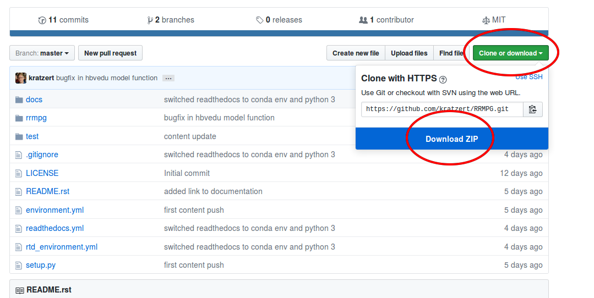

.. _getting_started:

Getting started
===============

Setting up Python
-----------------

First of all you need to have Python. I highly recommend you to use Anaconda_.
Got to there homepage and download and install the latest Python 3 installer.

.. _Anaconda: https://www.continuum.io/downloads

Downloading the source code
---------------------------

Since this package is in the early stages of development I havn't added it to PyPI - Pythons Package Index - so you can't install it at the moment using ``pip``. For the moment you have to download the source code from GitHub. You can either download the entire repository as ``.zip`` and extract it to any destination on your machine

Or you use your terminal and the following commands:

.. code-block:: bash

    git clone https://github.com/kratzert/RRMPG

Setting up RRMPGs Python dependencies
-------------------------------------
To use/develope this package, you have two different options:

1. (recommended) You use a conda environment to use and develope this package. In the main directory is file included (``environment.yml``) that will setup everything for you by the following command:

From the terminal go to the ``RRMPG`` main directory and enter:

.. code-block:: bash

    conda env create -f environment.yml

You can then activate the environment by entering:

.. code-block:: bash

    # on linux and macOS
    source activate rrmpg

    # on windows
    activate rrmpg

To leave an environment enter

.. code-block:: bash

    # on linux and macOS
    source deactivate

    # on windows
    deactivate

2. (not recommend but possible) You make sure that you have all dependencies installed in your normal/root environment.

The list of dependencies are:

- Python 3.x
- Numpy
- Matplotlib
- Numba
- Jupyter
- IPython
- Pandas
- Scipy

Installing the RRMPG package
----------------------------

To be able to import this package the usual way in your python environment, enter the following command in the terminal, assuming you are in the RRMPG root directory:

.. code-block:: bash

    python setup.py install

This should install everything correctly. To confirm, that everything worked as expected you can test the following lines of code:

.. code-block:: bash

    # start Python console
    python

    # now in Python try the following
    >>>from rrmpg.models import ABCModel

If no error is raised: Congratulations, you now can use the package on your local machine.
